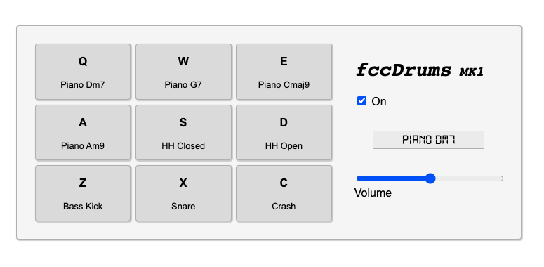

### Drum Machine

A simple drum machine web app built for the freeCodeCamp front-end certificate.

A live build can be found [here](https://aaronishibashi.com/portfolio/web/drum-machine).

## Tools

Libraries
- React
- Redux

Dev
- TypeScript
- Stylus
- Webpack

## Build

Run `npm install` then `npm run build`

The `dist/` contains the index.html, css, js, assets, etc.
